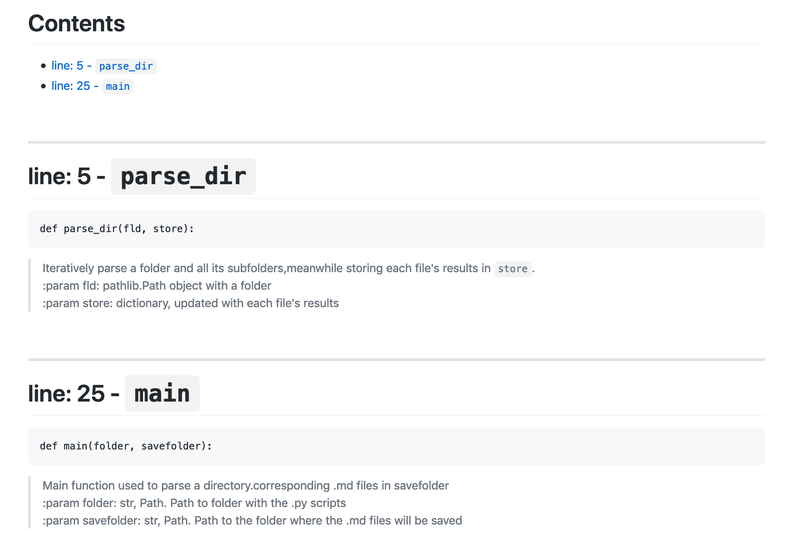

# pydoc2md
inspired by https://github.com/gbowerman/py2md


`pydoc2md` is lightweight python application that generates markdown (`.md`) files from a repository of `.py`. The idea is to easily generate bare bones documentation for a python project by providing a list of all classes and functions, each with their docstring. 

----

A `.md` file is generated for each `.py` in the input didirectoryrection or in its subfolders. 
This `.md` file includes all class/functions defined in the `.py` with a brief description. The result is something that looks like this: 


**using pydoc2md** is very simple. From the command line:
```
    pydoc2md project/path output/path
```

For instance, the `.md` files in [Docs](Docs) where generated with
```
    pydoc2md Github/pydoc2md/pydoc2md Github/pydoc2md/Docs
```

# Installation
Currently you can isntall  with:

```
pip install git+https://github.com/FedeClaudi/pydoc2md.git
```

though a pip installable version will be released when the project is more mature.